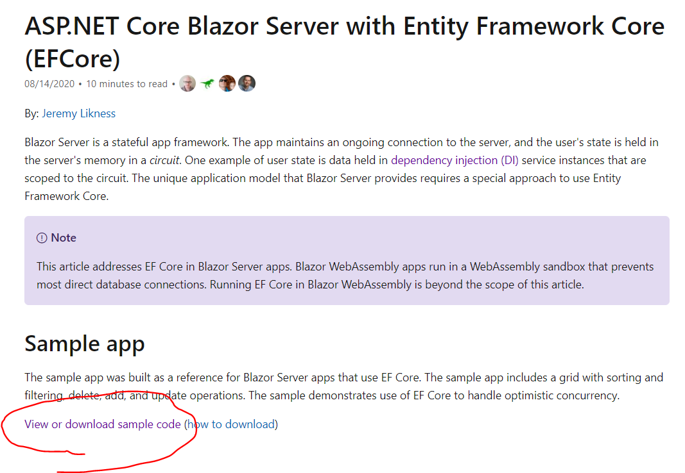
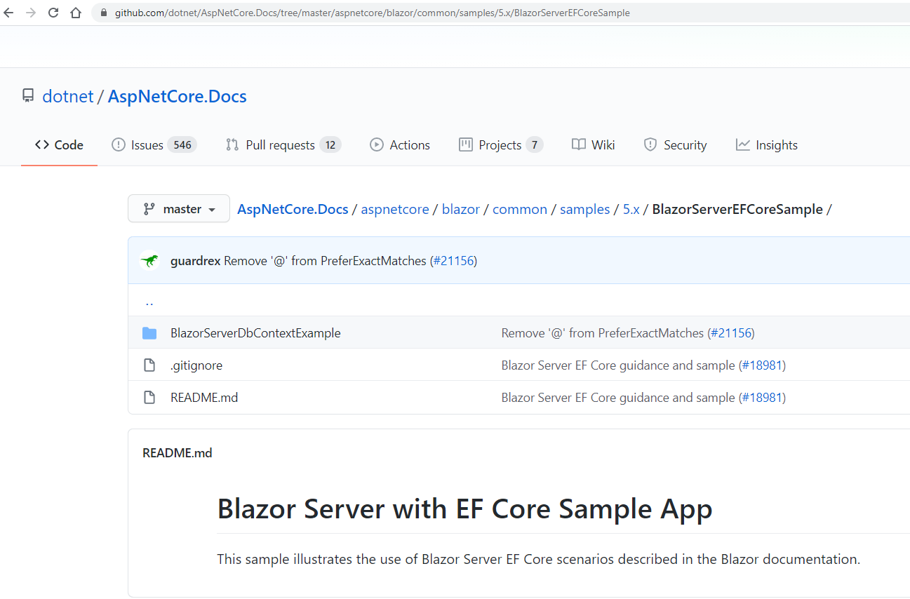
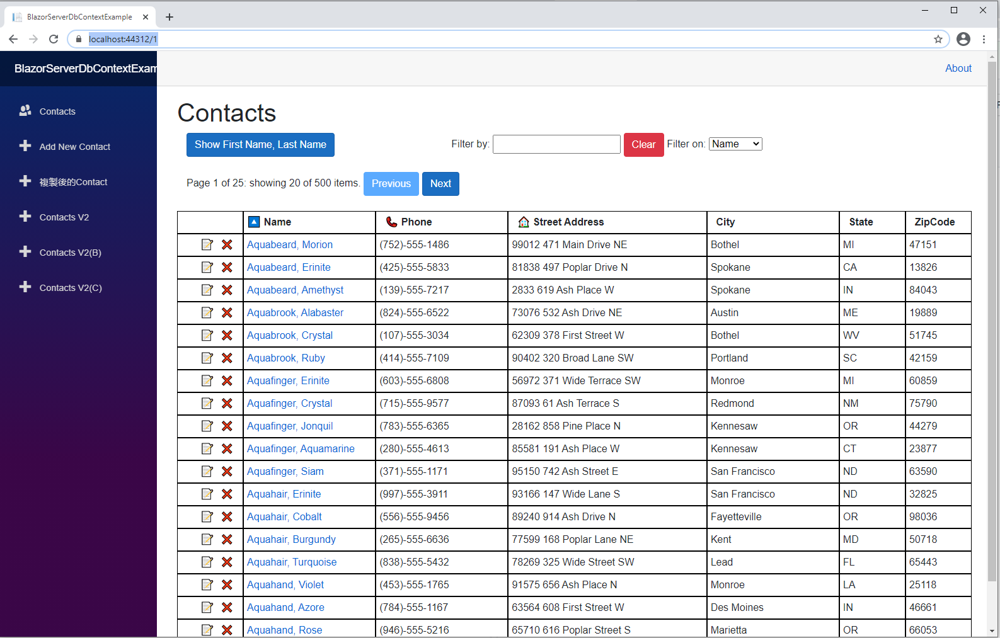
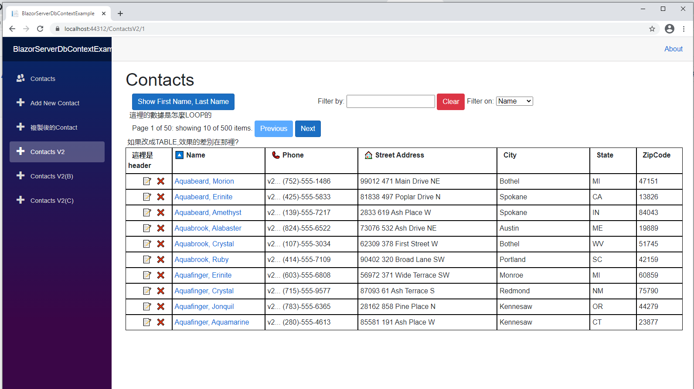
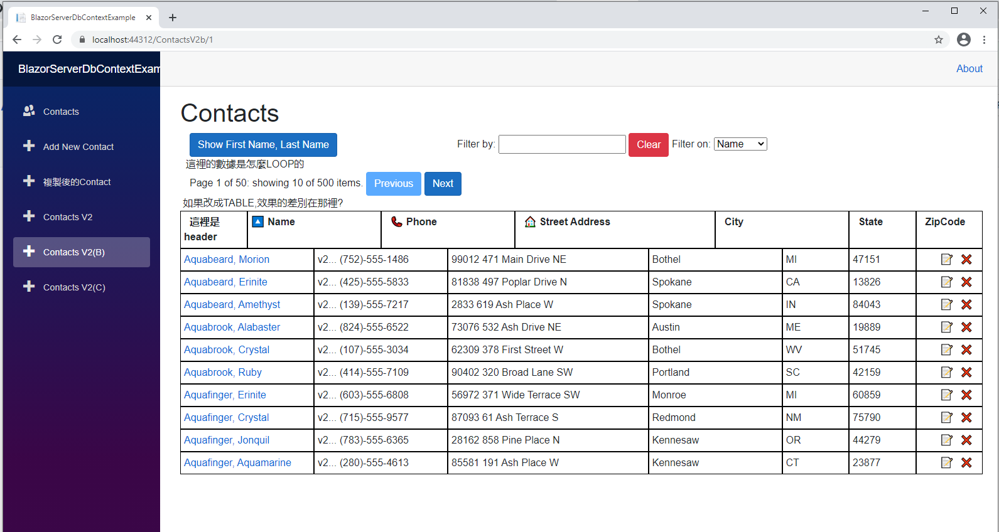
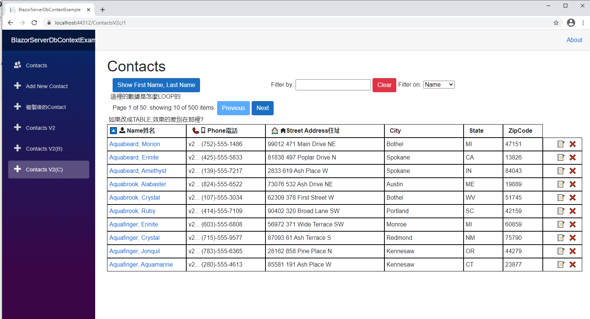
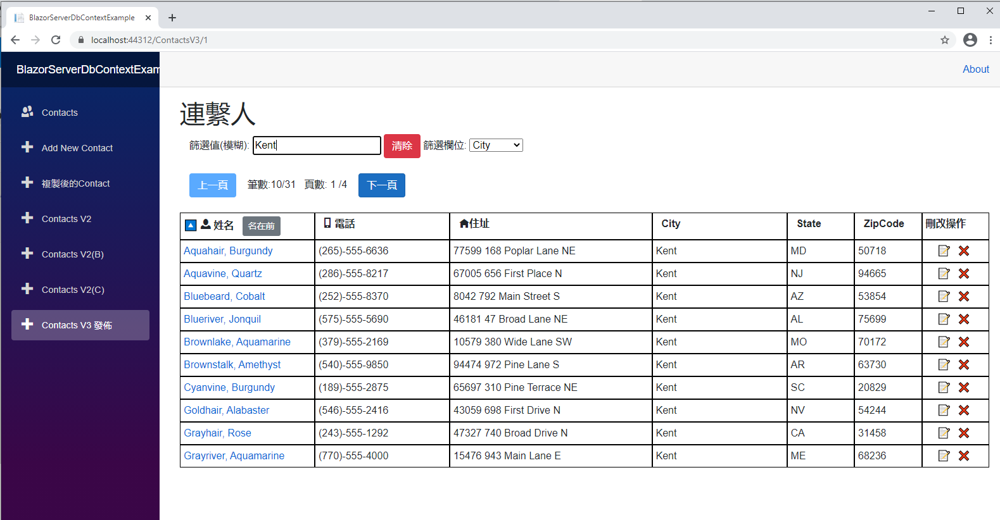

# Jeremy Likness,08/14/2020, 在官網文檔介紹了 ASP.NET Core Blazor Server with Entity Framework Core (EFCore)

https://docs.microsoft.com/en-us/aspnet/core/blazor/blazor-server-ef-core?view=aspnetcore-5.0

---

> 這部份的代碼範例, 簡單 dotnet restore 後就可以正常運行,連絡人的增刪改查的功能都有。從代碼看使用了 Repository Pattern , 算是中高級別。
> 查詢的部分包括了,(1)篩選(2)排序(3)分頁,這三種功能。為了準備後續的交流, 我在建立新的頁面都保留之前的功能, 可以參照優化前和優化後。由於頁面上顯示20筆在我電腦上的畫面還要下接, 於是先改為10筆，這個算是基本功。重點是在保留原本仍然是20筆,只是有版本V2才顯示10筆。然後進一步調整欄位的順序和欄位名稱中文以及圖標。突然發現,排序的功能失效了,雖然解決了三角和倒三角表示正序或反序的排法, 但是沒有功能。在實做裡, 受到時間限制時, 這種情況也不是太不尋常, 與其放著沒有功能, 不如先隱藏掉。
> #### Note by Mark陳炳陵, 2020-01-11

### 1. 使用最簡的 Console 來演示, 其中沒有展開的 DemoContextFactory是另一個梗,先不展開,直接使用。

---
### 2. 雖然課程有核心主題, 仍然要有設定的情境, 也透過這個基本設定複習 best practicez。

---
### 3. 這是說明[Required]的兩種寫法。

---
### 4. 這是今天的焦點, 只能寫在這。

---
### 5. 這是刻意讓代碼運行在這裡報錯代碼。

---
### 6. 這個 Runtime error 是數據庫回饋的。

---

### 7. 最後這是一個作業

---
### 8. 說明了最低要求

---
### 9. 還有一些要注意的事項

---

### 教程:
https://youtu.be/_3QiR07dfL4

### 代碼:
https://github.com/rstropek/htl-leo-csharp-4/blob/master/exercises/9110-tournament-planner/sample-solution/TournamentPlanner/Program.cs
